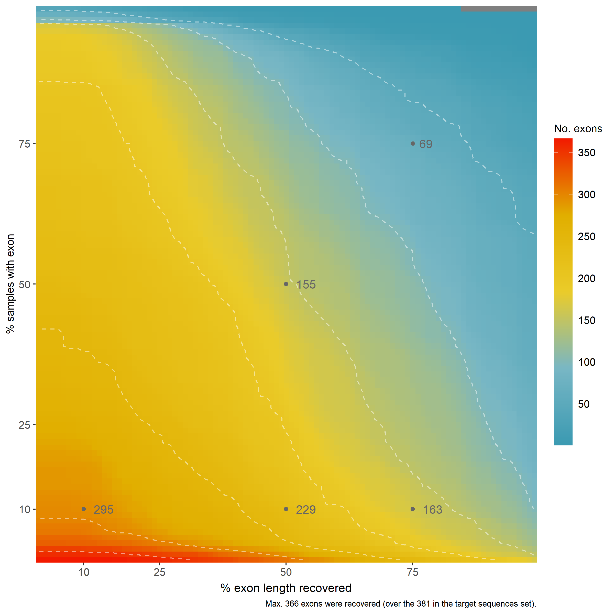

Loci filtering
================

**Author**: [Léo-Paul Dagallier](https://github.com/LPDagallier)  
**Last update**: 2023-10-09

------------------------------------------------------------------------

Loci can be filtered. As we have seen [earlier](Paralogs.md), they can
be filtered on their putative paralogy status (i.e. completely remove
putative paralogous loci).

Loci can also be filtered on their **assembly statistics**. Specifically
they can be filtered on a percentage of samples (N) for which a
percentage of the length of the loci has been assembled (L). For
simplicity, let’s call these the **L_N subsets**. For example, a 75_75
subset will only include those loci that have been recovered for at
least 75% of their length in 75% of the samples.

Additional lists of loci can be drawn from the paralogy statistics.
These are exploratory and should be used with caution. They include
e.g. list of loci with maximum 1 copy (no paralogy at all), or loci with
a median of 2 copies per sample.

Sub-loci identified with [ParaGone](Paragone.md) can be filtered based
on the number of samples they were recovered in. (UNDER CONSTRUCTION)

## L_N subset(s)

Filter loci on their assembly statistics with the **L_N subsets**.  
L_N subset = loci that have been recovered for at least L% of their
length in N% of the samples. For example, a 75_75 subset will only
include those loci that have been recovered for at least 75% of their
length (L) in 75% of the samples (N).

We here need the assembly statistics output by
[HybPiper](https://github.com/LPDagallier/Phylogenomics_Workshop/blob/master/HybPiper2.md#13-summary-statistics),
specifically the genes_sequences_lengths.tsv file that contains the
length assembled for each locus in each sample.

We will use the R script
[`loci_filtering.R`](PHYLOGENY_RECONSTRUCTION/R/loci_filtering.R). This
script needs the following to be defined in the R environment:

- genes_sequences_lengths_raw: a data frame with loci sequences length
  per sample, as output by HybPiper (genes_sequences_lengths.tsv)
- limit_perc_length_wanted: a vector with all the L values desired
- limit_perc_nb_wanted: a vector with all the N values desired

Once run, the script will output:

- a text file for every L_N subset defined with the list of loci in the
  subset (`list_L_N.txt`)
- a text file for every L_N subset defined with the bash copy command of
  loci in the subset (`move_L_N.txt`)
- a table summarizing the number of loci recovered for the different L
  and N values (`exon_filtering_stats.csv`)
- a gradient plot (heatmap) representing the number of loci recovered
  for each percentage of samples and percentage of length assembled
  (`exon_recovery_gradient_samples.png`)
- additional density plots of the exons length recovery
  (`L_N_exon_length_density.png`)

Define the path to the directory where the genes_sequences_lengths.tsv
is stored.

``` r
path_to_data <- "PHYLOGENY_RECONSTRUCTION/JOBS_OUTPUTS/example_analysis_01_extract/"
filename = paste0(path_to_data, "/genes_sequences_lengths.tsv")
```

Load the table in R.

``` r
genes_sequences_lengths_raw <- read.table(filename, header = T, row.names = 1, sep = "\t", check.names = F)
```

Define the path to the directory where the output files (= lists of loci
in L_N subset(s), additional figures, see below).

``` r
path_to_out <- "PHYLOGENY_RECONSTRUCTION/DATA/example_analysis_01/"
```

Define the path to the script.

``` r
path_to_script <- "C:/Users/ldagallier/Documents/RESEARCH/DATA_ANALYSES/PHYLOGENY_RECONSTRUCTION/R"
```

Define the L_N subsets. Both vectors have to be the same length. L_N
subsets are defined by the combination of both values at a position in
the vectors, so values have to be ordered according to the L_N subset
you want to define (1st values are assembled together, and so on). E.g.,
the following will return 4 subsets (10_10, 50_50, 75_75 and 50_75).

``` r
limit_perc_length_wanted = c(0.1, 0.5, 0.75, 0.5) #L
limit_perc_nb_wanted = c(0.1, 0.5, 0.75, 0.75) #N
```

Run the script.

``` r
source(paste0(path_to_script, "loci_filtering.R"))
```

See [here](PHYLOGENY_RECONSTRUCTION/DATA/example_analysis_01/) for all
the output examples. The `list_L_N.txt` text files are the list that you
will later use to filter the loci.

The `exon_recovery_gradient_samples.png` figure is an easy way to
illustrate the locus recovery depending the on the length recovered and
the number of samples for which the locus was recovered:  The `L_N_exon_length_density.png` help
visualizing the distribution of recovered length across the loci
(e.g. here for a 50_50 locus): 

## Paralogs subsets

### Manually identified paralogs

See [Paralogs assessement](Paralogs.md).

### Alternative subsets from paralogy statistics

These subsets are exploratory and should be used with caution. The idea
is to select subsets of loci based on paralogy statistics. They include
e.g. list of loci with maximum 1 copy (no paralogy at all), or loci with
a median of 2 copies per sample.

This makes use of the file `paralog_report.tsv` output by
`hybpiper paralog_retriever`.

``` r
library(tidyverse)
path_to_out <- "PHYLOGENY_RECONSTRUCTION/DATA/example_analysis_01/"
path_to_data <- "PHYLOGENY_RECONSTRUCTION/JOBS_OUTPUTS/example_analysis_01_extract/"
filename = paste0(path_to_data, "/paralog_report.tsv")
paralog_report <- read.table(filename, header = T, sep = "\t", check.names = F)
paralog_report_long <- paralog_report %>% 
  pivot_longer(cols = -1, names_to = "Locus", values_to = "N_copy")
paralogs_summary_stats <- paralog_report_long %>%
  # na_if(0) %>%
  group_by(Locus) %>% 
  summarise(mean = mean(N_copy, na.rm = T), median = median(N_copy, na.rm = T), sum = sum(N_copy, na.rm = T), max = max(N_copy, na.rm = T))

# Plot median
ggplot(paralogs_summary_stats)+
  geom_histogram(aes(median))+ theme_minimal()
```


``` r
# Plot mean
ggplot(paralogs_summary_stats)+
  geom_histogram(aes(mean))+ theme_minimal()
```


``` r
# Plot max
ggplot(paralogs_summary_stats)+
  geom_histogram(aes(max),binwidth = 1)+ theme_minimal()
```


``` r
# Plot the number of copies for each samples in each locus
ggplot(paralog_report_long)+
  geom_boxplot(aes(x = Locus, y = N_copy))+ theme_minimal() + theme(axis.text.x = element_text(angle = 90, hjust = 1))
```


Filter the loci based on their paralogs statistics and export the lists
into text files.

``` r
# maximum 1 copy
max1 <- paralogs_summary_stats %>% filter(max <= 1)
max1$Locus
cat(
  x = sort(paste0(max1$Locus)),
  file = paste0(path_to_out, "list_max1.txt"),
  sep = "\n"
)

# maximum median 2 copy and maximum 4 copies
med2 <- paralogs_summary_stats %>% filter(median <= 2) %>% filter(max <= 4)
med2$Locus
cat(
  x = sort(paste0(med2$Locus)),
  file = paste0(path_to_out, "list_med2.txt"),
  sep = "\n"
)
```

## N subset(s) (ParaGone loci)

:construction: :construction: :construction: TO BE COMPLETED
:construction: :construction: :construction:
