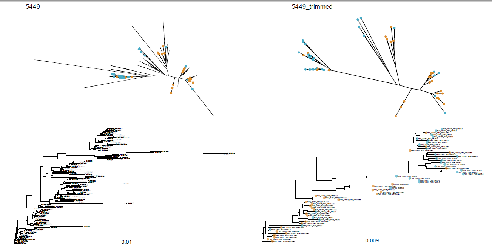

```{r setup, include=FALSE}
knitr::opts_chunk$set(echo = TRUE,
                      eval = FALSE)
```

**Author**: [Léo-Paul Dagallier](https://github.com/LPDagallier)    
**Last update**: `r format(Sys.Date())`

***


#### Paralogs identification
To identify the paralogs, HybPiper will extract all the copies assembled for each genes when multiple copies per gene per sample where assembled.
```{bash}
hybpiper paralog_retriever namelist.txt -t_dna targetfile.fasta --heatmap_filetype pdf --heatmap_dpi 300
```

Run a quick phylogenetic reconstruction of the loci to inspect for the multi-copies loci:
```{bash}
cd paralogs_all
cat locus1_paralogs_all.fasta | mafft --auto | FastTree -nt -gtr > locus1_paralogs_all.tre
```

To loop it over all the loci present in the working directory, we first need to get the list of loci. We'll extract this list from the file `paralogs_above_threshold_report.txt` created by the `paralog_retriever`.
```{bash}
cat paralogs_above_threshold_report.txt | sed '1,/The gene names are:/d' > paralogs_all/loci_with_paralog_warning.txt
```

Then loop it over all the loci and run it in parallel:
```{bash}
for locus in $(cat loci_with_paralog_warning.txt) ;
do
echo "cat "$locus"_paralogs_all.fasta | mafft --auto --quiet - | FastTree -nt -gtr > "$locus"_paralogs_all.tre"
done | parallel -j8
```


Once the trees are inferred for the paralogs, run the R script [`plot_hybpiper_paralog_trees.R`](PHYLOGENY_RECONSTRUCTION/R/plot_hybpiper_paralog_trees.R) to visualize the trees in a convenient way. The script creates a single .pdf file with one locus per page.
```{bash}
Rscript plot_hybpiper_paralog_trees.R
```

For each locus, on the left are 2 plots of the tree with all the samples (including the samples with single copy), and on the right, 2 plots of the tree with only the samples that have more than 1 copy for this locus. Top plots represent the trees unrooted, bottom plots represent the same trees rooted. In orange are the ".main"copy, selected by HybPiper, and in blue are all the other copies (".0", ".1", etc.).



Then inspect all the trees and decide which locus present paralogy and should be discarded. You can store in a text file the list of the paralogous loci you want to discard either as a simple loci list:
```{bash}
locus_to_move_1
locus_to_move_2
...
```

or as a list of moving commands:
```{bash}
mv *locus_to_move_1* paralogs
mv *locus_to_move_2* paralogs
```


