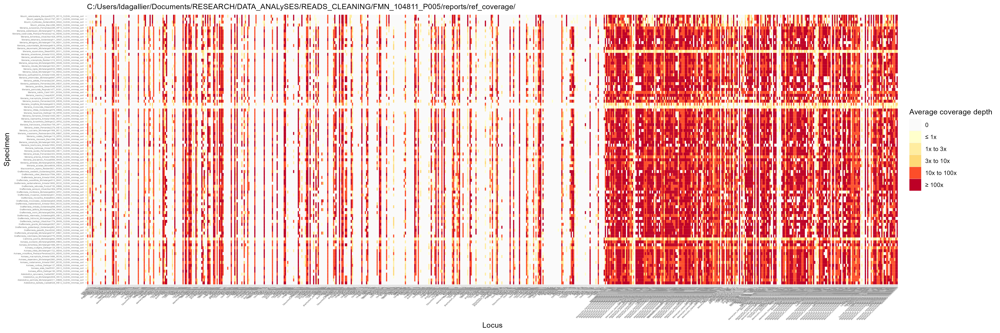
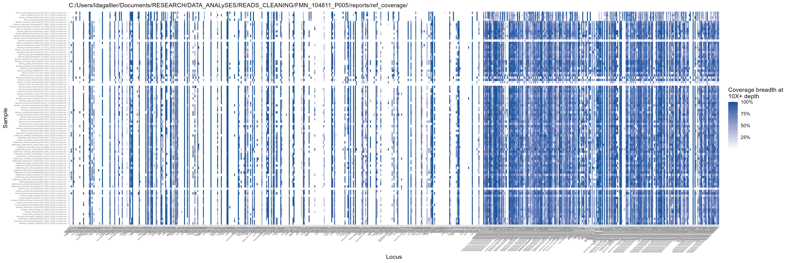

```{r setup, include=FALSE}
knitr::opts_chunk$set(echo = TRUE,
                      eval = FALSE,
                      out.width = "50%")
```

The reads obtained from the sequencing have to be cleaned before they can be used for downstream analysis. 

The following assumes that:  

- A run of cleaning is carried out for a full plate identified as `<plate_ID>`
- The cleaning will be run in a temporary directory whose path is `path_to_tmp`

:point_right: :computer: See directly the [script for local use **TO DO**](PHYLOGENY_RECONSTRUCTION/SCRIPTS_local/hybpiper2_assemble.sh)  
:point_right: :woman_technologist: See directly the [script for cluster (SLURM) use **TO DO**](PHYLOGENY_RECONSTRUCTION/SCRIPTS_cluster/hybpiper2_assemble_TEMPLATE.sh), or jump to [Note for cluster users][Note for cluster (SLURM) users]. 

# Preparation

## Define the paths and variables
The name of the plate
```{bash}
plate_to_clean="<plate_ID>"
```

The path to the raw (i.e. not cleaned) reads:
```{bash}
path_to_plate_dir="<path_to_raw_reads>/"$plate_to_clean
```

The path to the reference file (used to compute some statistics):
```{bash}
path_to_ref="<base_directory>/DATASETS/PHYLOGENOMICS/target_references"
reference_fasta_file="target_reference.FNA"
```

The path to the R scripts for plotting statistics:
```{bash}
path_to_R_script="<base_directory>/DATA_ANALYSES/READS_CLEANING/R"
```

The output directory:
```{bash}
path_to_dir_out="<base_directory>/DATA_ANALYSES/READS_CLEANING/"$plate_to_clean;
```

Temporary directory for local users:
```{bash}
path_to_tmp=$path_to_dir_out
```

Temporary directory for cluster users: depends on the cluster manager and its setup (please see with your cluster documentation), e.g. for SLURM on HiperGator:
```{bash}
path_to_tmp=$SLURM_TMPDIR
```

## Copy raw reads to clean
Go to working directory.
```{bash}
cd $path_to_tmp
```

Copy from orange storage the data to clean
```{bash}
scp -r $path_to_plate_dir $path_to_tmp
cd $plate_to_clean
```

## Pre cleaning step
For some plates, the sequencing was performed on 2 lanes, which means that every specimen of these plates get 4 .fastq files: `SampleID_lane1_R1.fastq`, `SampleID_lane1_R2.fastq`, `SampleID_lane2_R1.fastq` and `SampleID_lane2_R2.fastq` (instead of only `SampleID_R1.fastq` and `SampleID_R2.fastq`).

In theses cases, we need to merge the files of the 2 lanes in a single file before cleaning, ending up with 2 .fastq files per specimen (R1 and R2).

```{bash}
for i in *_L001_R1_001.fastq.gz ;
do pattern=${i%%_L001_R1_001.fastq.gz*} ; 
echo $pattern;
cat ${pattern}_L001_R1_001.fastq.gz ${pattern}_L002_R1_001.fastq.gz > ${pattern}_R1_001.fastq.gz;
cat ${pattern}_L001_R2_001.fastq.gz ${pattern}_L002_R2_001.fastq.gz > ${pattern}_R2_001.fastq.gz;
done
rm *_L001_*  *_L002_*

for i in *_L001_R1.fastq.gz ;
do pattern=${i%%_L001_R1.fastq.gz*} ; 
echo $pattern;
cat ${pattern}_L001_R1.fastq.gz ${pattern}_L002_R1.fastq.gz > ${pattern}_R1_001.fastq.gz;
cat ${pattern}_L001_R2.fastq.gz ${pattern}_L002_R2.fastq.gz > ${pattern}_R2_001.fastq.gz;
done
rm *_L001_*  *_L002_*
```


# Reads cleaning

For cleaning the reads, we want to:

-   remove the adapters
-   pair the R1 and R2 reads (for paired-end data)
-   filter the reads on their mean quality (average phred score of 30 minimum)
-   filter the reads on their length (35 bp minimum)
-   filter the reads on the percentage of bad quality bases they contain
-   remove PCR duplicates

Note that there is no strict rule for filtering the reads. The different filters applied here can be adjusted depending on your data set (both in terms of thresholds for the filters and in terms of number of filters). You can also try different combinations of filter/thresholds and see how it affects your results.

Several tools exist for applying one or all of the filters mentioned above, like [FastQC](https://www.bioinformatics.babraham.ac.uk/projects/fastqc/), [Trimmomatic](https://github.com/usadellab/Trimmomatic), [Cutadapt](https://cutadapt.readthedocs.io/en/stable/), [fastp](https://github.com/OpenGene/fastp), among others.

Here we chose **fastp** because it is fast, reliable, flexible, and execute all the desired cleaning steps in a single command line.

We will use the following fastp options/parameters (see [this page](https://github.com/OpenGene/fastp#all-options) for the full list of fastp options):  
`-e` average read quality (phred score)  
`-l` minimum read length  
`-q` define the minimum phred quality for a base to be qualified  
`-u` define the maximum percentage of unqualified base to be kept in a read  
`-D` enable deduplication to drop the duplicated reads or pairs of reads  
`-c` enable base correction in overlapped regions  
`-w` define the number of thread used (remember that you should adjust this number to the number of `--cpus-per-task` requested for your job)

```{bash}
for i in `ls *_R1_001.fastq.gz` ;
do pattern=${i%%_R1*} ; 
echo $pattern ;
fastp -i ${pattern}_R1_001.fastq.gz -I ${pattern}_R2_001.fastq.gz -o ${pattern}_CLEAN_R1.fastq.gz -O ${pattern}_CLEAN_R2.fastq.gz -j ${pattern}_report.json -h ${pattern}_report.html -e 30 -l 35 -q 15 -u 40 -y -D -c -w 2 ;
done
```

```{bash}
mkdir clean_reads
mv *CLEAN* ./clean_reads

mkdir reports
mv *report.* ./reports
```

The clean reads (i.e. the reads that passed all the filter defined above) are output in the `clean_reads` folder.

Fastp also outputs reports in html and json formats. You can download the html reports locally and examine how your filtering parameters affected your data.

## Transfer the clean reads to output directory
(only in cases the temporary directory is different from the output directory)  
```{bash}
mkdir $path_to_dir_out
scp -rp $path_to_tmp/clean_reads $path_to_dir_out/
scp -rp $path_to_tmp/reports $path_to_dir_out/
```

# Sequencing statistics
## Number of clean paired R1 and R2 reads

One important statistic we want to keep in mind is the number of clean (and paired) reads. This number can be obtained while looking at the html fastp reports. But manually extracting this number for every specimen is fastidious. We will thus automatically retrieve this number from the `fastp` json reports obtained after the cleaning step, and store these numbers in a text file we call `clean_reads_true_count.csv`.

```{bash}
cd ./reports
rm clean_reads_true_count.csv # remove the file in case it already exists
echo 'name, raw_reads, clean_reads' > clean_reads_true_count.csv
for i in `ls *report.json` ;
do pattern=${i%%_report.json} ;
raw_reads=$(grep '"before_filtering"' -A1 $i | grep -E '[[:digit:]]*' -o)
clean_reads=$(grep '"after_filtering"' -A1 $i | grep -E '[[:digit:]]*' -o)
echo $pattern, $raw_reads, $clean_reads >> clean_reads_true_count.csv
done
cd ../
```

The number of clean and paired reads (R1+R2) is written in the `clean_reads_count.csv` file for every sample.

## Alignment and coverage statistics
> Note that some of theses statistics will be also computed by HybPiper later on

We have to make sure that the sequences recovered (the clean and paired reads from the previous step) are the ones we are targeting. To do so, we need to align the reads on the target sequences and to compute some coverage statistics to make sure that we have enough reads covering the region of interest.  
Indeed, sometimes the extraction and/or sequencing of some specimens (generally old or degraded specimens) goes wrong and the sequences recovered are out of target or not covering enough the targeted regions.

### Alignment of the reads to the reference

We align the clean reads to the reference with [Minimap2](https://github.com/lh3/minimap2):

```{bash}
cd ./clean_reads
scp $path_to_ref/$reference_fasta_file ./

for i in `ls *CLEAN*.fastq.gz` ;
do pattern=${i%%CLEAN*} ; 
echo $pattern;
minimap2 -ax sr -t 2 -B 1 $reference_fasta_file ${pattern}CLEAN_R1.fastq.gz ${pattern}CLEAN_R2.fastq.gz > ${pattern}CLEAN_minimap.sam;
done
```

Note that this can also also be done with [BWA](http://bio-bwa.sourceforge.net/bwa.shtml) (but slower):
```{bash}
cd ./clean_reads
scp $path_to_ref/$reference_fasta_file ./
bwa index $reference_fasta_file

for i in `ls *CLEAN*.fastq` ;
do pattern=${i%%CLEAN*} ; 
bwa mem -B 1 -t 8 $reference_fasta_file ${pattern}CLEAN_R1.fastq ${pattern}CLEAN_R2.fastq >${pattern}CLEAN_BWA.sam;
done
```

Compress the .sam files into .bam files (gain of space)

```{bash}
# the command is executed only if the .bam file doesn't already exists
for i in *.sam ;
  do pattern=${i%%.sam} ;
  if [ ! -f "${pattern}.bam" ]; then
    echo ${pattern};
    samtools view -@ 1 -bh $i > ${pattern}.bam;
  fi;
done
```

Sort the reads in the alignments and create an index for the alignments (for samtools to be faster).

```{bash}
for i in *.bam ; do pattern=${i%%.bam} ; echo ${pattern}; samtools sort -@ 2 -o ${pattern}_sort.bam $i ; done
for i in *sort.bam ; do samtools index $i ; done
```

### Coverage statistics

The **breadth** of coverage describes the proportion of the targeted sequences that is actually covered by the sequencing. The **depth** coverage describes the number of times a position in the sequence is covered by a read (1X at position *i* means that only 1 read covers the position *i*, 10X at position *i* means that 10 reads cover the position *i*).

We want the following stats:

-   number of paired R1 and R2 reads
-   number of alignments (= might be higher than the number of mapped reads as a read can align to different parts of the reference)
-   number of mapped reads
-   % of useful reads
-   coverage 1X, 3X and 10X+
-   mean depth (and stdev)

For explanation purposes, the following sections present step by step how to obtain the statistics for EXAMPLE.bam alignment.  
At the end, these statistics will be computed for .bam files in a `for` loop and stored in a file called `mapping_statistics.csv`. You can refer directly to this section to directly get the statistics for every file.

#### Number of mapped alignments and unmapped reads

Retrieve the number of *mapped* and *unmapped* reads. We use the command `samtools view` to exclude (`-F`) or keep (`-f`) the reads having been flagged as unmapped (`0x4`) in the alignment. Use the argument `-c`to only output the number of filtered reads.

```{bash}
# Count mapped reads
samtools view -F 0x4 -c EXAMPLE_sort.bam
# write a file with only the mapped reads
samtools view -F 0x4 EXAMPLE_sort.bam -o EXAMPLE_sort_mapped_reads.bam
# Count the unmapped reads
samtools view -f 0x4 -c EXAMPLE_sort.bam
```

#### Breadth and depth of coverage

Get the percentage of the reference covered at at least 1X, 3x and 10x depths. We use [bedtools](https://bedtools.readthedocs.io/en/latest/content/tools/genomecov.html) for that. By default, bedtools outputs the number of bases that map on the reference at 1X, 2X and so on. Here, the bedtool output is send to the `grep` function through a pipe `|` in order to select only the information we want from the bedtools output (you can try `genomeCoverageBed -ibam EXAMPLE_sort_mapped_reads.bam -max 10 > output.txt` and `head output.txt` to look at what bedtools output looks like).

```{bash}
module load bedtools/2.30.0

# coverage 1X+
genomeCoverageBed -ibam EXAMPLE_sort_mapped_reads.bam -max 1 | grep -e 'genome\s10' | grep -o '0\..\+'
# coverage 3X+
genomeCoverageBed -ibam EXAMPLE_sort_mapped_reads.bam -max 3 | grep -e 'genome\s3' | grep -o '0\..\+'
# coverage 10X+
genomeCoverageBed -ibam EXAMPLE_sort_mapped_reads.bam -max 10 | grep -e 'genome\s1' | grep -o '0\..\+'
```

Get the average depth per base over the reference. With `-d` option, bedtools outputs the coverage depth per base in the reference. The output is then send to a custom function (build with `awk`) computing the average and standard deviation of the the depth across the reference.

```{bash}
genomeCoverageBed -ibam EXAMPLE_sort_mapped_reads.bam -d > EXAMPLE_reference_coverage.txt
cat EXAMPLE_reference_coverage.txt | awk '{sum+=$3; sumsq+=$3*$3} END { print "Average=",sum/NR; print "Stdev=",sqrt(sumsq/NR - (sum/NR)*(sum/NR))}' > temp_output.txt
average=$(grep -e 'Average=\s' temp_output.txt | sed 's/Average=\s//')
stdev=$(grep -e 'Stdev=\s' temp_output.txt | sed 's/Stdev=\s//')
echo $average
echo $stdev
```

The `EXAMPLE_reference_coverage.txt` files will later be used to plot the coverage across the reference.

#### Export the statistics and coverage plots

Compute the previously explained statistics for every alignment file and store all these stats in a file called `mapping_statistics.csv`.

```{bash}
rm mapping_statistics.csv # remove the file in case it already exists
touch mapping_statistics.csv # creates an empty file

echo 'name, mapped_alignments, unmapped_reads, cov1x, cov3x, cov10x, average, stdev' > mapping_statistics.csv
for i in *sort.bam ;
do pattern=${i%%.bam} ;
echo ${pattern};
mapped=$(samtools view -@ 1 -F 0x4 -c $i)
samtools view -@ 1 -F 0x4 $i -o $pattern'_mapped_reads.bam'
unmapped=$(samtools view -@ 1 -f 0x4 -c $i)
cov1x=$(genomeCoverageBed -ibam $pattern'_mapped_reads.bam' -max 1 | grep -e 'genome\s1' | grep -o '0\..\+')
cov3x=$(genomeCoverageBed -ibam $pattern'_mapped_reads.bam' -max 3 | grep -e 'genome\s3' | grep -o '0\..\+')
cov10x=$(genomeCoverageBed -ibam $pattern'_mapped_reads.bam' -max 10 | grep -e 'genome\s10' | grep -o '0\..\+')
genomeCoverageBed -ibam $pattern'_mapped_reads.bam' -d > $pattern'_reference_coverage.txt'
cat $pattern'_reference_coverage.txt' | awk '{sum+=$3; sumsq+=$3*$3} END { print "Average=",sum/NR; print "Stdev=",sqrt(sumsq/NR - (sum/NR)*(sum/NR))}' > temp_output.txt
average=$(grep -e 'Average=\s' temp_output.txt | sed 's/Average=\s//')
stdev=$(grep -e 'Stdev=\s' temp_output.txt | sed 's/Stdev=\s//')
rm temp_output.txt
echo $pattern'_mapped_reads', $mapped, $unmapped, $cov1x, $cov3x, $cov10x, $average, $stdev >> mapping_statistics.csv
done
head mapping_statistics.csv
```

Move the statistics file and other useful files into the `report` folder and sub folders.

```{bash}
mv mapping_statistics.csv ../reports
mkdir ../reports/ref_coverage
scp *reference_coverage.txt ../reports/ref_coverage
```

Plot heatmaps showing the average depth and coverage breadth at each locus for the set of specimen:

```{bash}
cd ../reports/ref_coverage
scp $path_to_R_script/post_cleaning_coverage_heatmap.R ./
module load R/4.1
Rscript post_cleaning_coverage_heatmap.R
```
The **coverage depth**:


The **coverage breadth** at least 10x:



Clean the `report` folder:
```{bash}
rm *.R *.txt
cd ../
mkdir ./fastp_reports
mv *.html ./fastp_reports
rm *.json
```


Download the whole `reports` folder locally. We are particularly interested in the files `clean_reads_true_count.csv` and `mapping_statistics.csv`. Having a look at the heatmap, the coverage depth figures, and the fastp reports might be interesting too.


The `clean_reads_true_count.csv` should look like that:

| name                              | clean_reads |
|-----------------------------------|-------------|
| Mecranium_acuminatum_LCM7928_WC12 | 8400244     |
| ...                               | ...         |

-   The **clean_reads** column returns the true number of clean reads (R1+R2).

The `mapping_statistics.csv` should look like that:

| name                                                              | mapped_alignments | unmapped_reads | cov1x    | cov3x    | cov10x   | average | stdev   |
|---------|---------|---------|---------|---------|---------|---------|---------|
| Mecranium_acuminatum_LCM7928_WC12_CLEAN_minimap_sort_mapped_reads | 3972956           | 4430488        | 0.526637 | 0.467193 | 0.418466 | 1060.6  | 2051.69 |
| ...                                                               | ...               | ...            | ...      | ...      | ...      | ...     | ...     |

-   The **mapped_alignments** is the number of read mappings against the reference. This can actually be higher than the true number of mapped reads because a same read can hit against several parts of the reference and thus count twice or more.

-   The **unmapped_reads** is the number of reads that didn't mapped against the reference.

-   The **cov1x** is the coverage breadth with at least 1x coverage depth (i.e. the percentage of the reference that was covered by at least 1 bp from the aligned reads). Same for **cov3x** and **cov10x** with at least 3x and 10x, respectively.

-   The **average** is the average coverage depth across all the reference, and **stdev** is its standard deviation.

Note that to obtain the **true number of mapped reads**, you should subtract **unmapped_reads** from **clean_reads** (8'400'244 - 4'430'488 = 3'969'756 in the example). This also permits the calculation of the percentage of usable reads **%UR** = **true number of mapped reads** / **clean_reads** (3'969'756 / 8'400'244 = 47.26% in the example).

## Transfer the summary statistics and plots to output directory
(only in cases the temporary directory is different from the output directory)  
```{bash}
scp -rp $path_to_tmp/clean_reads $path_to_dir_out/
scp -rp $path_to_tmp/reports $path_to_dir_out/
```

## Clean the output directory
Once everything looks good, you can clean the `clean_reads` folder to keep only the .fastq.gz files.
```{bash}
cd /blue/soltis/dagallierl/DATASETS/Phylogenomics/Reads_cleaning/FMN_104811_P005/clean_reads/
rm *.sam *.bam *.bai *.R *.fa *.txt
```

# Note for cluster (SLURM) users
You can modify the [`reads_cleaning_TEMPLATE.sh` **TO DO**](/DATA_ANALYSES/READS_CLEANING/SCRIPTS_cluster) script:

- set the correct SLURM configuration parameter (default one should be ok)
- set the correct paths and variable names according to the plate you want to clean
- read the whole script and make sure you understand all the steps (if you don't, these are explained above)
- transfer the `.sh` script to your script directory on the cluster

```{bash}
ssh dagallierl@hpg2.rc.ufl.edu # connect to the cluster (replace with your credentials)
# go to your script directory on the cluster
cd /blue/soltis/dagallierl/DATA_ANALYSES/READS_CLEANING/SCRIPTS_cluster
sbatch reads_cleaning_<plate_ID>.sh
```

